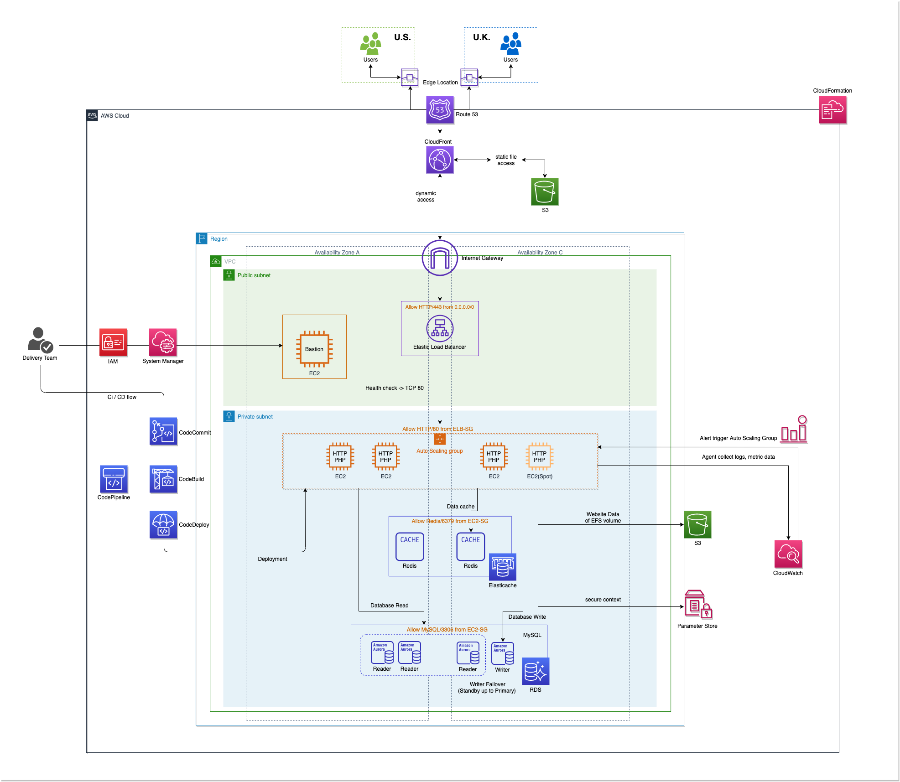

# AWS Simple LAMP Stack

## Architecture

## Well-Architected Recommended

The recommended architecture on LAMP stack with the 5 Well-Architected pillars of Security, Cost Optimisation, Reliability, Performance Efficiency & Operational Excellence.

### Security

1. Design VPC with public and private Subnets separation internet requests and private application, databases.

2. Use a session manager of Web Console, command line, SSH and SCP protocol login Bastion.

3. Use HTTPS transit and KMS encrypt S3 object and RDS storage.

4. Save secure context to Parameter Store.

### Cost Optimization

1. S3 with Website data enable Lifecycle to Glacier for inactive objects greater than 6 months.

2. Placing your instances of Amazon EC2 Auto Scaling with the ability to control the mix of On-Demand and Spot.

3. Buy Savings Plans and Reserved instances with demand instances of one or three years period.

### Reliability

1. Placing your instances in multiple Availability Zones also improves the fault tolerance in your application. If one Availability Zone experiences an outage, traffic is routed to the remaining Availability Zones.

2. Placing your RDS enable with Multi-AZ and Reader instances.

3. Migrate your Website Data to S3 shared for instances.

4. Snapchat EC2 instances when event of a disaster.

5. Enable RDS snapchat and “point in time” when event of a disaster.

### Performance Efficiency

1. Amazon EC2 Auto Scaling helps you ensure that you have the correct number of Amazon EC2 instances available to handle the load for your application by automatically adjusting the capacity on-demand.

2. Read and write separation of RDS.

3. Priority access to Elasticache of Redis's cache data.

4. Use CloudFront points the browsers at the closest Edge Location of users.

### Operational Excellence

1. Perform operations as code: In the cloud, you can apply the same engineering discipline that you use for application code to your entire environment. You can define your entire workload (applications, infrastructure) as code and update it with code and replicate cloud environments.

2. Use CloudWatch monitor your infrastructure logs, metrics and alert.

3. Use System Manager manage instances for patching and maintenance window.

4. Placing your deployment pipeline of CodeCommit, CodeBuild, CodeDeploy and CodePipeline.

